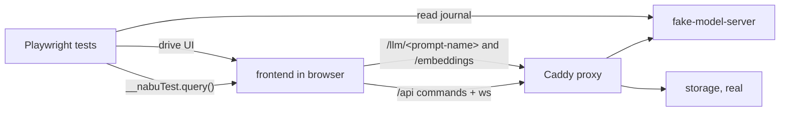

# Claims e2e suite

nabu-e2e runs the self-hosted nabu stack in docker and drives it with Playwright to verify the behavior claims in [frontend-behavior-claims.md](../../../../frontend-behavior-claims.md). Each claim is tagged there with a tier: 💾 claims run against the stack alone, 🎭 claims run with the model and embeddings services replaced by a fake that replays fixture files from disk, and 🔌 claims run against the unmodified stack with real providers. Tests carry their claim label as a tag, so one command runs the tests behind one checkbox.

## Components

- [fake-model-server](fake-model-server.md) — one container that fills the stack's `chancery` and `embeddings` service slots, streams canned Responses-format SSE from fixture files, returns deterministic embedding vectors, and journals every request for tests to assert against.
- [stack-harness](stack-harness.md) — the compose override that boots the stack from the local sibling repos with the fake in place and a throwaway project volume, wired into Playwright's setup and teardown.
- [test-suite](test-suite.md) — the Playwright project: three run tiers, one folder per claim section, claim labels as tags.
- [frontend-test-hook](frontend-test-hook.md) — a change to nabu-frontend: a build-flag-gated `window.__nabuTest` exposing DuckDB queries, present only in e2e builds.
- [seeder](seeder.md) — a change to nabu-self-hosted: the existing seed program generalized to seed the first project from a directory of files; e2e mounts its base corpus there, every other deployment keeps the welcome document.

## Data flow, stubbed tier

The diagram shows who talks to whom when a 🎭 test runs: the browser reaches only the proxy, the fake stands where chancery and the embeddings relay stood, and the tests reach around the browser only for the fake's journal and the DuckDB hook.

The 💾 tier runs the same stack: every project boot fires embeddings and topic-assignment traffic, the fake answers it from the standing boot fixtures ([test-suite](test-suite.md)), and 💾 tests simply assert nothing about it. In the 🔌 tier there is no override at all: chancery, dragoman, and the embeddings relay run real, and the tests keep to UI assertions.

## Walking skeleton

The first thing built and tested is one test that threads every component:

1. The harness boots the stubbed stack from a clean state, from the local repos, with the e2e frontend build; the seeder fills the first project from the checked-in base corpus.
2. Playwright opens the app, lands on the base project, and waits for boot to finish — which already proves the fake's embeddings surface and the boot fixture set, because boot blocks on embedding the seeded corpus and assigning its topics.
3. The test sends one chat message. A fixture matches the `/qual-coder` request and streams a marker text back. The test asserts the marker renders.
4. The test runs one `window.__nabuTest.query()` against the `files` table and asserts rows exist.
5. The test reads the fake's journal and asserts the boot-time embeddings request is recorded.

To run it you need: docker with compose v2, the siblings the stubbed tier builds checked out beside nabu-e2e — `nabu-frontend`, `nabu-storage`, and `nabu-self-hosted` itself — a free port for the stack, and node for Playwright. No API keys, and no other siblings: `nabu-embeddings`, `nabu-prompts`, chancery, and dragoman enter only in the 🔌 tier, which also needs `OPENAI_API_KEY`.

## What must not change

- `nabu-self-hosted/compose.yaml`, its `Caddyfile`, and `nabu-embeddings/Caddyfile` stay byte-identical: the harness is a separate override file. Pinned by the 🔌 smoke test: given the unmodified stack and valid keys, when `docker compose up` runs without any override, then the app serves and answers a chat message.
- A nabu-frontend production build stays hook-free: given a build without `VITE_E2E`, when the app loads, then `window.__nabuTest` is undefined. Pinned in [frontend-test-hook](frontend-test-hook.md).
- The nabu-frontend unit suites (vitest, colocated `*.test.ts` files) keep passing unchanged.
- The seeder's default behavior is today's: given no seed directory configured, when a stack boots on an empty store, then exactly one project with the welcome document appears. Pinned by the existing seed tests (`nabu-self-hosted/seed/main_test.go`), which keep passing unchanged.
