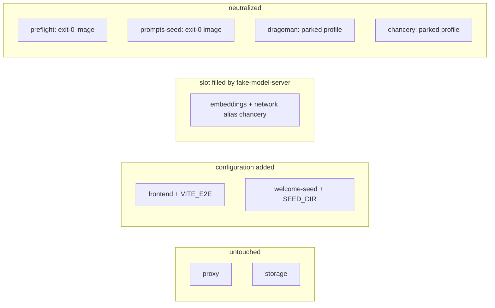

# Stack harness

The stack harness boots the self-hosted stack for a test run and tears it down afterwards; it is the stack-harness component of the [claims e2e suite](spec.md).

It owns two artifacts: `nabu-e2e/compose.e2e.yaml`, an override file merged over [nabu-self-hosted/compose.yaml](../../../../nabu-self-hosted/compose.yaml), and the Playwright global setup and teardown that run compose, wait for readiness, and hand the [test-suite](test-suite.md) a base URL.

The 💾 and 🎭 tiers share one harness mode: both boot the override stack, and which tests run is the tier distinction, owned by the test-suite. The harness therefore has two modes — override and real — and accepts all three tier names so the suite passes its tier straight through.

## Contract

### Surface

Environment in:

- **NABU_E2E_TIER** — `stubbed` (default), `stack`, or `real`; the first two select the override mode, `real` boots the base file alone. Any other value fails setup before docker is invoked, like the version and key checks below.
- **NABU_PORT** — the stack's only published port (compose.yaml:10); the harness defaults it to `8099` so an unset environment never lands on the dev default `8090`.
- **NABU_E2E_KEEP** — when set, teardown is skipped, the stack stays up for debugging, and the harness prints the exact command that removes it.
- **OPENAI_API_KEY** — required in real mode only (see Real mode); the override mode must boot with no provider key set.

Promises out:

- **Base URL** — `http://localhost:<port>`, exported to the tests as Playwright's `baseURL` before the first test runs.
- **Readiness** — the base URL meets the three conditions under Readiness before Playwright starts, or setup fails with the stack's compose logs in the failure output.
- **Clean teardown** — `down` with volumes removed runs on pass and on fail; only `NABU_E2E_KEEP` suppresses it.
- **Booted tier** — the harness records, beside the base URL, which mode actually booted; the [test-suite](test-suite.md)'s real-project guard reads it, so real-tier tests can never run against an override stack silently.
- **Volume read** — on request, the harness returns the bytes of a named path inside the storage volume (a one-shot container mounting `projects` read-only), because storage's HTTP surface has no file-read endpoint and its image is scratch with no shell; this is the channel for claims about files on disk — Y8 and the companion files of E1/E3 ([test-suite](test-suite.md)).
- **Source invariance** — no file under `nabu-self-hosted` or any sibling repo is created or modified; every change travels through the override file, environment variables, or compose flags.

Side effects at the boundary:

- **Docker daemon** — images, containers, and a network under the compose project `nabu-e2e`; the image build cache persists across runs, which is what keeps reboots fast.
- **One host TCP port** — the resolved `NABU_PORT`.
- **Named volumes** — `nabu-e2e_projects` and `nabu-e2e_prompts`, the base file's `projects` and `prompts` volumes (compose.yaml:193-197) prefixed by the project name; they exist only between setup and teardown.

### Two stacks, one machine

The base file pins its project name to `nabu` (compose.yaml:1), so the harness passes its own project name `nabu-e2e` on every compose command; containers, the network, and both named volumes are prefixed by project name, and with the port default above a developer's `docker compose up` in `nabu-self-hosted` and a test run share nothing.

The harness points the build contexts at the local sibling checkouts by exporting the variables the base file already interpolates — `NABU_FRONTEND_REPO`, `NABU_STORAGE_REPO`, `NABU_EMBEDDINGS_REPO`, `CHANCERY_REPO`, `DRAGOMAN_REPO`, `NABU_PROMPTS_REPO` (compose.yaml:26,40,54,79,97,114), whose defaults are github URLs — because the suite exists to test the local working tree. Setup fails before invoking docker when a sibling the selected mode builds is missing: override mode builds `nabu-frontend`, `nabu-storage`, and the [fake-model-server](fake-model-server.md) image from `nabu-e2e` itself (the other build slots are replaced or parked below), real mode builds all six siblings.

### The override file

Every service slot in the base file has exactly one fate under the override:

**frontend** gains the build arg `VITE_E2E` (owned by [frontend-test-hook](frontend-test-hook.md)) beside the baked `VITE_API_HOST`, `VITE_LLM_HOST`, and `VITE_EMBEDDINGS_URL` (compose.yaml:29-32). Vite variables are compile-time — the [frontend Dockerfile](../../../../nabu-frontend/Dockerfile) bakes them into the static bundle (Dockerfile:19-27) — so the e2e frontend image is a different image from the production one; real mode builds without the override and so without the hook, which is what keeps the production-build pin in [spec.md](spec.md#what-must-not-change) honest.

**embeddings** keeps its service name but runs the [fake-model-server](fake-model-server.md) image with the network alias `chancery`, so both proxy routes (Caddyfile:42-44, 48-50) resolve to the one fake container — which owns both ports, both path surfaces, and the health answer, one container so its request journal is one journal. The base slot carries a `build` with `dockerfile_inline` — the caddy relay assembled in place (compose.yaml:52-60) — so the override replaces the whole block with `build: !override` pointing at the fake's context in `nabu-e2e` through an env-interpolated absolute path: a plain `image:` beside the surviving base `build` or a map-merged `build` would leave the inline relay Dockerfile winning, and the slot would silently run the relay. The fixtures directory from `nabu-e2e` is mounted read-only into it; the mount is an absolute host path interpolated from a variable the harness sets, following the `STORAGE_DATA` host-path-via-variable pattern (compose.yaml:43-46), because relative paths in a merged file resolve against the first file's directory ([compose merge docs](https://docs.docker.com/reference/compose-file/merge/)) and a `./fixtures` here would land inside `nabu-self-hosted`. The base embeddings healthcheck (compose.yaml:66-71) merges onto the fake unchanged, so answering it is part of the fake's contract.

**preflight** and **prompts-seed** have their `build` cleared with `!reset` and run a stock image whose command exits 0. They must still complete successfully rather than disappear, because every long-running service gates on `preflight: service_completed_successfully` (compose.yaml:19-21 and each service alike) and preflight gates on prompts-seed the same way (compose.yaml:178-180). Clearing preflight's `build` is also what prevents the expensive build: its image otherwise builds FROM the stack's dragoman image via `additional_contexts: dragoman: service:dragoman` (compose.yaml:160-168), which would force the minutes-long dragoman build even though dragoman never runs.

**chancery** and **dragoman** are parked behind a compose profile the harness never activates. An override cannot delete a service — the merge tags remove attributes, not services — and exit-0 stand-ins are the wrong fit here because both carry `restart: unless-stopped` (compose.yaml:93, 110), so a completing command would restart forever; a profiled service "is only started if the profile is activated" ([profiles docs](https://docs.docker.com/compose/how-tos/profiles/)). The docs' requirement that no enabled service depend on a profile-gated one holds: nothing depends on chancery, and dragoman's only dependent is chancery, parked beside it.

The `!reset` and `!override` merge tags require Docker Compose 2.24.4 or later per the merge docs; the harness checks the compose version before booting and refuses older.

### Throwaway data

Setup first removes any leftover `nabu-e2e` project with its volumes — a kept stack or a crashed run — then boots onto absent volumes, and teardown removes volumes again, so every run starts with empty storage. `STORAGE_DATA` stays unset, keeping storage's data in the project-prefixed `projects` volume (compose.yaml:46). On the empty store, the [seeder](seeder.md) creates the base project: the override sets its `SEED_DIR` and mounts `nabu-e2e/base-project/` read-only — the same env-interpolated absolute-path mount as the fixtures — so the seeded corpus lives in the throwaway volume and vanishes with it. In real mode nothing is mounted, `SEED_DIR` stays unset, and the seeder writes its default welcome document.

### Readiness

Ready is three conditions, polled through the published port, in order:

1. `GET /health` answers — the proxy responds to this itself (Caddyfile:34) even when every upstream is down (Caddyfile:32-33), so this proves only that the port is up.
2. `GET /` returns the app shell — the frontend's own server behind the catch-all route (Caddyfile:54-56), the same surface its image healthcheck probes ([frontend Dockerfile](../../../../nabu-frontend/Dockerfile):39).
3. `GET /api/queries/projects` lists at least one project — this proves storage is serving through its route (Caddyfile:38-40; the [storage image](../../../../nabu-storage/Dockerfile) healthchecks itself, Dockerfile:41) and that welcome-seed completed, which nothing inside the stack gates on (compose.yaml:187-188), so the harness is the only thing that waits for it.

Playwright is blocked until all three hold; on timeout, setup fails, prints the project's compose logs, and still tears down unless `NABU_E2E_KEEP` is set.

### Real mode

Real mode runs the base file with no override, plus the sibling-repo variables, project name, and port above. `OPENAI_API_KEY` must be set: prompts-seed resolves `MODELS` to the `openai` preset by default (compose.yaml:137,152), that preset runs [every model tier on OPENAI_API_KEY alone](../../../../nabu-prompts/config/models.openai.yaml), and preflight derives its required keys from the resolved models.yaml (compose.yaml:175-177), so a keyless boot fails preflight and every gate (compose.yaml:19-21) holds the stack down. The harness checks the key before invoking docker so the failure is one line rather than a wall of gate errors. The environment passes through, so `MODELS` or `MODELS_FILE` (compose.yaml:151-153) can select another preset with its own keys; `openai` is the supported default.

## Prior art

In-repo, the base file already varies deployments through environment seams — the six repo build contexts (compose.yaml:26,40,54,79,97,114), `NABU_PORT` (compose.yaml:10), `STORAGE_DATA` (compose.yaml:46), and `MODELS`/`MODELS_FILE` (compose.yaml:151-153). The harness follows that pattern: everything it changes rides an existing variable, a compose flag, or the separate override file, which is what makes the byte-identical pin in [spec.md](spec.md#what-must-not-change) testable at all.

Playwright's [webServer](https://playwright.dev/docs/test-webserver) launches one command and calls it started when one URL answers 2xx (default timeout 60 s); this stack's ready condition is a predicate on a JSON body, and its teardown must remove volumes on failure and honor a keep flag, none of which fits that surface, so the harness uses [globalSetup and globalTeardown](https://playwright.dev/docs/test-global-setup-teardown), passing the base URL to tests through an environment variable as those docs describe. The docs prefer project dependencies over globalSetup for trace, report, and fixture integration; setup here does no browser work, so none of that applies.

Testcontainers was rejected in one line: it brings its own per-test container lifecycle, and docker compose already models this stack.

## Tests

### Skeleton

Given docker with compose 2.24.4+, the sibling repos checked out, and no API keys, when setup runs with the default tier, then Playwright receives a base URL meeting all three readiness conditions — step 1 of the [walking skeleton](spec.md#walking-skeleton).

### Contract cases

Riskiest first:

1. **Keyless boot.** Given an environment with no provider key set, when the override stack boots, then readiness is reached, no dragoman container exists in the project, and no dragoman image was built — the exit-0 stand-ins and the parked profile proved in one run.
2. **Coexistence.** Given the dev stack running from `nabu-self-hosted` on its defaults (project `nabu`, port 8090), when a full e2e run boots and tears down, then the dev stack still answers on 8090 and its `projects` volume contents are unchanged.
3. **Volumes gone.** Given one run that passed and one made to fail, when teardown completes, then no container, network, or volume prefixed `nabu-e2e` remains.
4. **Byte-identical stack repo.** Given a checksum of every file under `nabu-self-hosted` taken beforehand, when a full run completes, then every checksum matches.
5. **Keep flag.** Given `NABU_E2E_KEEP` set, when the run ends, then the stack still answers, and the teardown command the harness printed removes it with its volumes.

### Isolation

The harness runs with no Playwright at all: a standalone invocation of the same setup code boots the override stack, plain `curl` observes the three readiness conditions in order, and teardown follows; the assertions are a zero exit and an empty volume list for the project. A failure here is a harness failure by construction, never a test-runner one.
